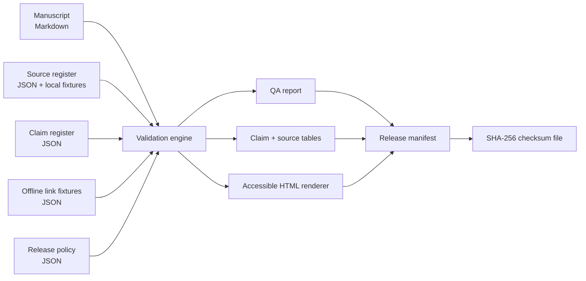

# Tracepress QA

Tracepress QA is a clean-room portfolio demonstration of a small, auditable technical-publishing pipeline. It turns a synthetic manuscript and structured evidence records into an accessible HTML publication, a machine-readable QA report, traceability tables, and a checksum-backed release manifest.

The project is intentionally offline-first: link responses come from declared fixtures, the example source material is invented, and the implementation uses only the Python standard library.

> **Status:** Portfolio demonstration, not a production publishing system. It is independently created and does not reproduce any employer code, content, prompts, manuscripts, paths, or analytics.

## What it demonstrates

- Structured source records with rights, confidentiality, provenance, and SHA-256 fingerprints
- Claim-to-source traceability, including simple reproducible checks against CSV evidence
- Manuscript gates for required sections, claim markers, heading structure, disclosure language, and unresolved editorial tokens
- Offline-safe link checking through an explicit fixture registry
- Accessible, responsive HTML with semantic landmarks, a skip link, visible focus styles, and a traceability table
- Deterministic release artifacts, a release manifest, and independently verifiable checksums
- Failure-oriented tests for broken claims, unregistered links, unresolved markers, and tampered artifacts

## Quick start

Requirements: Python 3.11 or newer. No packages or network access are required.

```bash
python -m publishing_qa check --workspace sample
python -m publishing_qa build --workspace sample --output sample/output
python -m publishing_qa verify --output sample/output
python -m unittest discover -s tests -v
```

The build command replaces only generated files inside the selected output directory. The sample output is committed so reviewers can inspect the result without running code.

## Inputs

| File | Purpose |
| --- | --- |
| `sample/input/sources.json` | Source register and handling metadata |
| `sample/input/claims.json` | Public claims, evidence locators, and optional reproducible checks |
| `sample/input/links.json` | Declared offline responses for manuscript links |
| `sample/input/release.json` | Fixed release identity, date, status, and disclosure |
| `sample/input/manuscript.md` | Synthetic publication source with `[claim:C-…]` markers |
| `sample/input/source_material/` | Invented local evidence fixtures |

## Outputs

| Artifact | Purpose |
| --- | --- |
| `qa-report.json` | Gate-by-gate pass/fail results and summary |
| `claim-traceability.csv` | One row per public claim, its source IDs, locators, and verification result |
| `source-register.csv` | Source metadata plus computed SHA-256 fingerprints |
| `sample-publication.html` | Standalone, accessible HTML rendering |
| `release-manifest.json` | Release metadata and artifact hashes |
| `CHECKSUMS.sha256` | Hashes for all release artifacts except the checksum file itself |

## Architecture



## Traceability model

Every public-facing factual statement in the sample manuscript carries a marker such as `[claim:C-001]`. Each marker resolves to a record in `claims.json`; each claim resolves to one or more source records; and each local source receives a content hash. Optional verification rules make selected claims executable rather than merely cited:

- `csv_row_count` checks a CSV's data-row count.
- `csv_nonempty_column` checks that every row has a value in a named column.
- `csv_value_count` counts rows matching a declared column value.

These checks are deliberately narrow and transparent. Passing them shows consistency within the synthetic fixture, not truth about the outside world.

## Quality gates

A build fails closed when any error-severity check fails. It checks:

1. JSON structure and unique identifiers.
2. Local source existence and path containment within the workspace.
3. Claim references, locators, manuscript markers, and optional verification rules.
4. Manuscript structure, required status/disclosure sections, and unresolved tokens such as `TODO`, `TK`, or `FIXME`.
5. Link syntax, HTTPS policy, local-file existence, and registration of every remote URL in the offline fixture set.
6. Release policy fields and public-demo classification.

Warnings remain visible in `qa-report.json` but do not block a build.

## Design boundaries

- This demonstration does not crawl the web, call an LLM, or validate external truth.
- It does not ingest DOCX, EPUB, PDF, or proprietary formats.
- The Markdown renderer intentionally supports only the small subset used by the sample.
- Accessibility features are engineered and tested at the markup level; this is not a substitute for assistive-technology testing with real users.
- Checksums detect changed bytes but do not provide signatures or trusted timestamping.

## AI and confidentiality disclosure

The software and synthetic fixture content were created with AI-assisted coding under human direction and review. No confidential source material was used. Every person, organization, record, measurement, and result in `sample/` is fictional and exists only to demonstrate the workflow.

## Repository map

```text
publishing-qa/
├── publishing_qa/       # pipeline, CLI, renderer, verification
├── sample/input/        # synthetic source, claims, links, manuscript, policy
├── sample/output/       # generated review artifacts
├── tests/               # unittest suite and negative cases
├── CHANGELOG.md
├── CONTRIBUTING.md
├── LICENSE
└── SECURITY.md
```

## License

Code and documentation are released under the MIT License. Synthetic sample content may be reused under the same terms.
